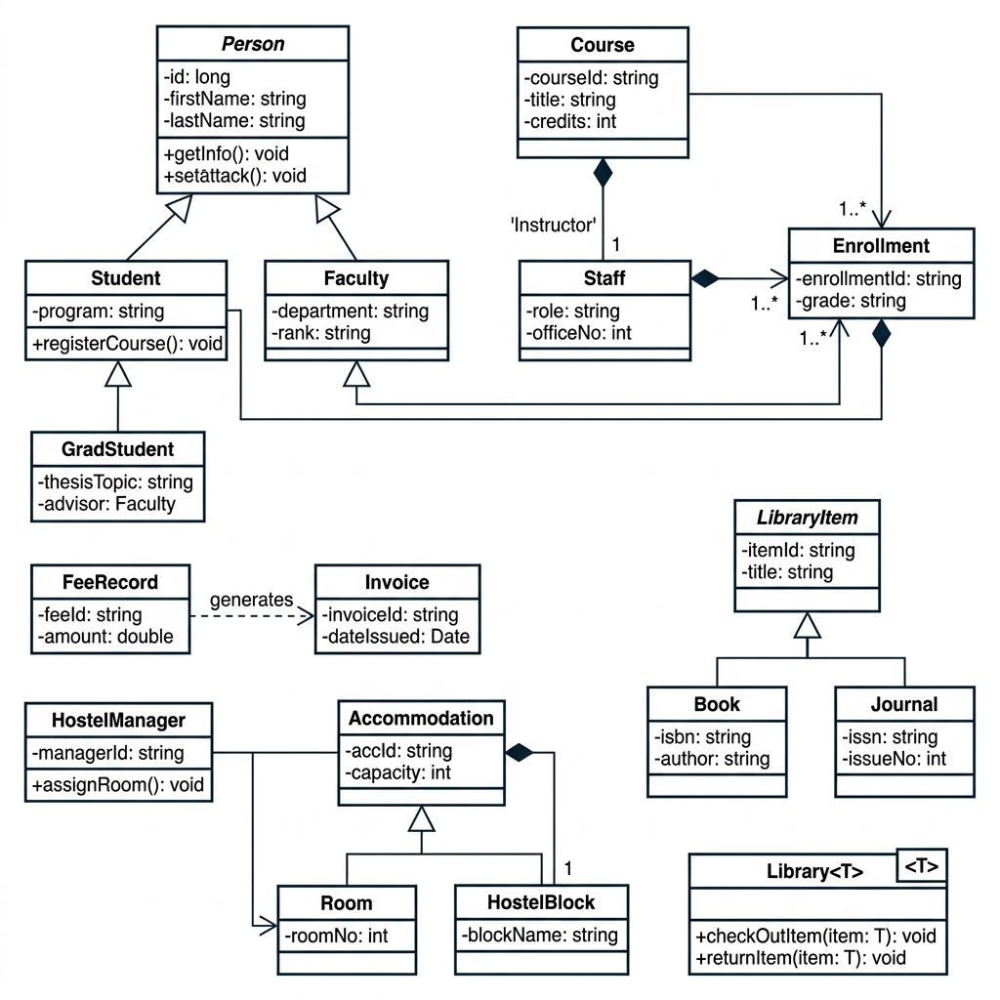

# Smart Campus Management System (SCMS)

## Project Info
- **Student:** Syed Muhammad Kashif | **Roll No:** 25-Cs-016 | **Course:** CS-202: Object-Oriented Programming (OOP) | **Institution:** HITEC University Taxila

## Project Description
The Smart Campus Management System (SCMS) is a comprehensive, multi-file C++17 command-line application designed to streamline the key administration workflows of a university campus. It provides robust subsystems for managing a polymorphic Person hierarchy (Students, Graduate Students, Faculty, and Staff), Course registrations, and Student Enrollments. Additionally, it integrates a templated Library system with CSV persistence, a Fee and Finance system utilizing custom copy/move semantics, and a Hostel Room allocator demonstrating virtual multiple inheritance to resolve the diamond problem. All subsystems are encapsulated and managed through modern C++ coding standards.

## OOP Concepts Demonstrated
1. **Classes & Objects:** Used across all modules to model entities like `Student`, `Faculty`, `Course`, `Book`, `Invoice`, etc.
2. **Encapsulation:** Implemented in all classes by marking data members as `private`/`protected` and exposing access via public getters/setters.
3. **Constructors:** Default, parameterized, and copy constructors implemented in `Person`, `Course`, and `FeeRecord`.
4. **Destructors:** Implemented in `Library` and `HostelManager` to perform custom memory cleanup and log object destruction.
5. **Single Inheritance:** `Student`, `Faculty`, and `Staff` inherit from the abstract base class `Person`.
6. **Multi-level Inheritance:** `GradStudent` inherits from `Student`, which inherits from `Person` (Person -> Student -> GradStudent).
7. **Multiple Inheritance:** `HostelManager` inherits from both `Accommodation` and `Reportable` abstract classes.
8. **Virtual Inheritance:** Used to resolve the Diamond Problem by making `Accommodation` and `Reportable` inherit virtually from `HostelService`.
9. **Abstract Classes & Pure Virtual:** `Person`, `LibraryItem`, and `Accommodation` define pure virtual methods (e.g., `displayInfo()`, `checkout()`, `allocateRoom()`).
10. **Runtime Polymorphism:** Achieved by calling `displayInfo()` dynamically on polymorphic pointers (`std::shared_ptr<Person>`).
11. **Operator Overloading:** Overloaded `==` in `Course` for code comparison, `<<` for custom stream output, and `-=` in `FeeRecord` for payment.
12. **Friend Functions:** Declared `operator<<` as a friend function in `Course` and `Invoice` to access protected/private data during stream output.
13. **Static Members:** Implemented `Invoice::invoiceCounter` static variable and associated static function to auto-increment invoice IDs.
14. **Copy Constructor (Deep Copy):** Implemented in `FeeRecord` to copy pointers and resource records without shallow referencing.
15. **Move Semantics (Rule of Five):** Implemented move constructor and move assignment operator in `Invoice` for efficient resource transfer.
16. **Function Templates:** Templated method `searchByTitle<T>()` in `Library<T>` works generically for Books and Journals.
17. **Class Templates:** `Library<T>` is a class template configured to manage collections of any library item type.
18. **STL Containers:** `std::vector` for lists, `std::map` for checkout registries, and `std::set` are used throughout.
19. **Exception Handling:** Custom `CapacityExceededException` and `OverdueException` thrown and handled using `try-catch` blocks.
20. **File I/O (fstream):** Reads student seed data from `students.csv` and persists/loads the catalog in `library_catalog.csv`.
21. **Namespaces:** Subsystems organized within `SCMS::Reports` (reporting functions) and `SCMS::Utils` (utilities, validations, dates).
22. **Smart Pointers:** Widespread use of `std::shared_ptr` for shared entities (like Students/Faculty) and `std::unique_ptr` for sub-managers.
23. **Lambda Expressions:** Sorting students by GPA, filtering overdue items, and matching keys using inline lambda functions.
24. **Composition:** `HostelBlock` objects are composed inside `HostelManager`, establishing a strong "has-a" relationship and managing their lifetimes.
25. **Aggregation:** `Course` holds a reference to a `Faculty` instructor object without owning its lifecycle (weak association).

## Modules
1. **Person Hierarchy:** Manages Students, GradStudents, Faculty, and Staff details polymorphically.
2. **Course & Enrollment Management:** Enrolls students in courses, supports waitlists, and enforces capacities.
3. **Library System:** Manages catalogs of books and journals, issues items, calculates fines, and handles file persistence.
4. **Fee & Finance Management:** Tracks fees, updates balances, and generates auto-incrementing invoices.
5. **Hostel Management:** Allocates/vacates single, double, or triple rooms within hostel blocks, resolving multiple inheritance.
6. **Reporting & Utilities:** Contains input validators, date parsers, and generates a consolidated state report.

## How to Compile & Run
Compile using a compiler supporting C++17 (such as GCC 8+ or MSVC 2017+):
```bash
g++ -std=c++17 src/person/*.cpp src/course/*.cpp src/library/*.cpp src/finance/*.cpp src/hostel/*.cpp src/utils/*.cpp src/main.cpp -o scms
./scms
```

## UML Class Diagram


## GitHub Repository
https://github.com/25-Cs-016/HITEC-OOP-SCMS-25-Cs-016
